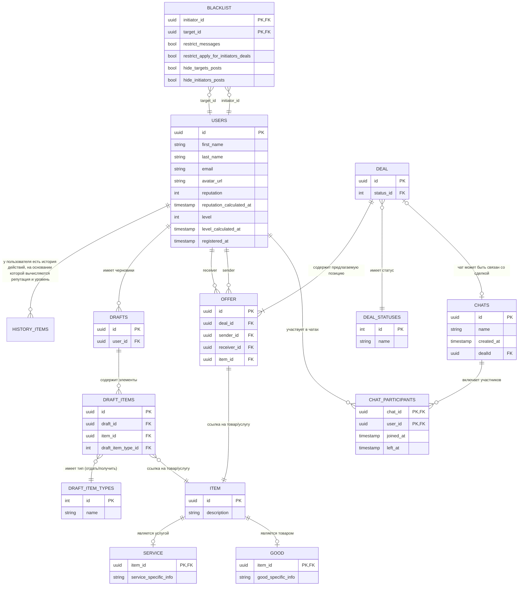
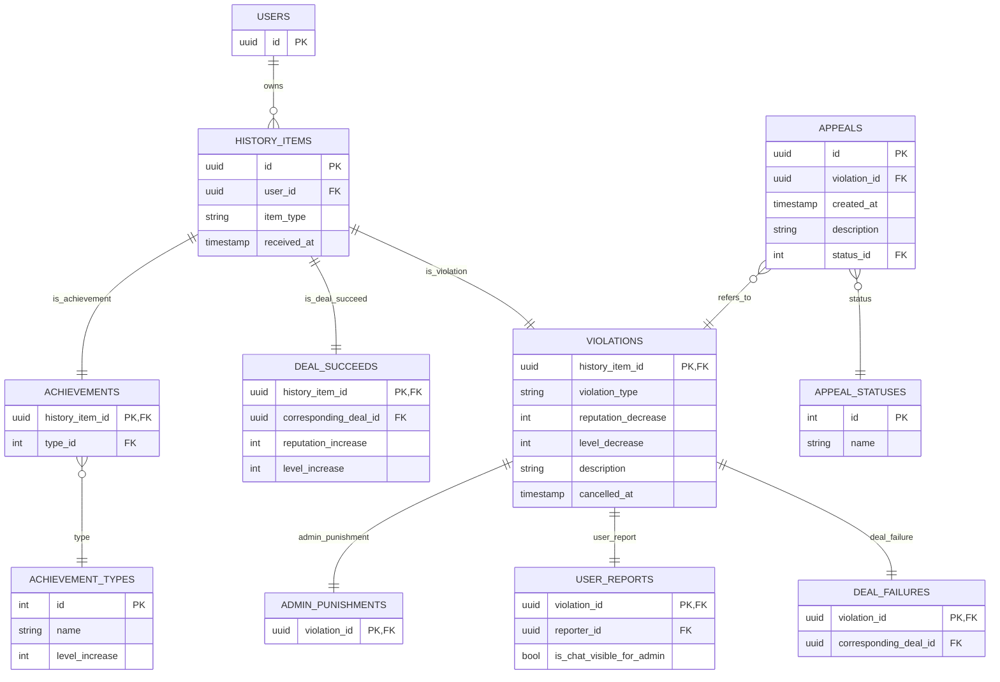

# Веб-приложение для бартерного обмена товарами и услугами
### Краткое название *"Barter Port"*

---

## Предназначение программы

Программа «Barter Port» предназначена для частных лиц, желающих обмениваться товарами и услугами без денежных расчетов. Пользователи смогут:
Создавать объявления о товарах и услугах, которые они предлагают или ищут.
- Искать подходящие варианты обмена по категориям, местоположению или по пользователям.
- Вести переговоры через встроенные чаты.
- Заключать сделки и фиксировать успешный обмен.
- Получать баллы и повышать уровень в рамках геймификации.

---

## Функциональные требования

- Регистрация и хранение информации о пользователях
- Возможность создания и хранения объявлений о товарах и услугах
- Управление сделками: участие пользователей, статус сделки, подтверждение условий
- Ведение чатов между участниками сделки
- Учёт жалоб и апелляций
- Система начисления очков за активность пользователей
- Черный список для пользователей

---

## Предварительная схема базы данных

DEAL_FAILURES здесь - событие, означающее, что другие участники сделки сочли его виновным в срыве.
Найти информацию о всех сорвавшихся сделках (в том числе случаи, когда обвинений не было предъявлено) можно
в таблице DEALS, отфильтровав по статусу 

---

## (Текстовые) ограничения на данные

- Каждый ITEM является либо товаром, либо услугой, но не одновременно
- Набор допустимых действий над сделкой (DEAL) функционально определяется её статусом
(DEAL_STATUSES)
- Один и тот же пользователь не может быть и sender, и receiver для одного и того же item
- Если чат связан со сделкой, то его набор участников определяется набором участников сделки
- Поля reputation и level в Users выполняют функцию кэша, реальные репутация и уровень
определяются через наследников HISTORY_ITEMS для конкретного пользователя
- VIOLATIONS / DEAL_SUCCEEDS / ACHIEVEMENTS
- Сделка должна содержать не менее двух записей в OFFER
  
  Каждое из этих событий не может существовать без HISTORY_ITEM и является специализацией
  одного события истории
- DEAL_FAILURES(corresponding_deal_id) должен соответствовать id проваленной сделки
- USERS.email уникален
- BLACKLIST: initiator_id != target_id

---

## Функциональные и многозначные зависимости

### Функциональные зависимости

#### USERS

- USERS.id ->
  first_name,
  last_name,
  email,
  avatar_url,
  reputation,
  reputation_calculated_at,
  level,
  level_calculated_at,
  registered_at

- USERS.email -> id, first_name, last_name, avatar_url, reputation, reputation_calculated_at,
  level, level_calculated_at, registered_at

#### ITEM / GOOD / SERVICE

- ITEM.id -> description

- GOOD.item_id -> good_specific_info

- SERVICE.item_id -> service_specific_info

- ITEM.id -> (принадлежность к GOOD или SERVICE)

#### DEAL_STATUSES

- DEAL_STATUSES.id -> name

#### DEAL

- DEAL.id -> status_id

- DEAL.id -> DEAL_STATUSES.name

#### OFFER

- OFFER.id ->
  sender_id,
  receiver_id,
  item_id

- (OFFER.id, sender_id) != receiver_id

#### CHATS

- CHATS.id ->
  name,
  created_at,
  dealId

#### CHAT_PARTICIPANTS

- (chat_id, user_id) ->
  joined_at,
  left_at

#### DRAFTS

- DRAFTS.id -> user_id

#### DRAFT_ITEM_TYPES

- DRAFT_ITEM_TYPES.id -> name

#### DRAFT_ITEMS

- DRAFT_ITEMS.id ->
  draft_id,
  item_id,
  draft_item_type_id

#### BLACKLIST

- (initiator_id, target_id) ->
  restrict_messages,
  restrict_apply_for_initiators_deals,
  hide_targets_posts,
  hide_initiators_posts

#### HISTORY_ITEMS

- HISTORY_ITEMS.id ->
  user_id,
  item_type,
  received_at

#### VIOLATIONS

- VIOLATIONS.history_item_id ->
  violation_type,
  reputation_decrease,
  level_decrease,
  description,
  cancelled_at

#### DEAL_FAILURES

- DEAL_FAILURES.violation_id -> corresponding_deal_id

- DEAL_FAILURES.corresponding_deal_id -> DEAL.status_id = (при котором name = failed)

#### USER_REPORTS

- USER_REPORTS.violation_id ->
  reporter_id,
  is_chat_visible_for_admin

#### DEAL_SUCCEEDS

- DEAL_SUCCEEDS.history_item_id ->
  corresponding_deal_id,
  reputation_increase,
  level_increase

#### ACHIEVEMENTS

- ACHIEVEMENTS.history_item_id -> type_id

#### ACHIEVEMENT_TYPES

- ACHIEVEMENT_TYPES.id ->
  name,
  level_increase

#### APPEALS

- APPEALS.id ->
  violation_id,
  created_at,
  description,
  status_id

#### APPEAL_STATUSES

- APPEALS.id ->
  violation_id,
  created_at,
  description,
  status_id

###  Многозначные зависимости отсутствуют

---

## Нормализация предварительной схемы

#### 1НФ

Все атрибуты атомарные -> в схеме все поля атомарные -> 1НФ выполняется

#### 2НФ

В каждой таблице выполняется: все неключевые поля зависят от всего ключа, а не части
-> 2НФ выполняется

#### 3НФ

Во всех таблицах отсутствуют транзитивные зависимости -> 3НФ выполняется

#### BCNF

Во всех ФЗ левая часть является суперключом -> BCNF выполняется
